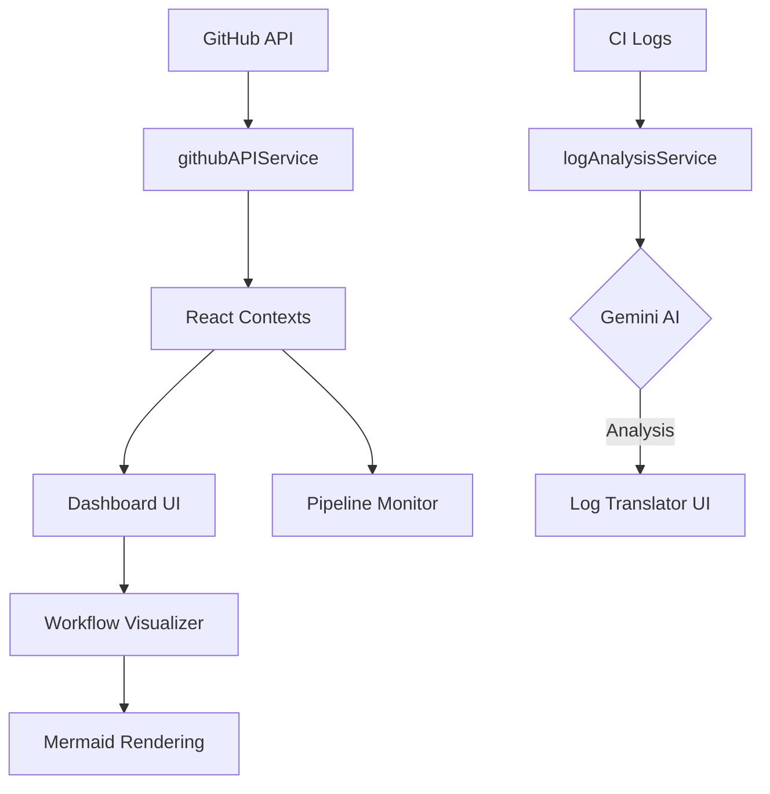

# <p align="center"> GitPro</p>

<p align="center">
  <strong>The Ultimate GitHub-Native CI/CD Toolkit</strong><br>
  <em>AI-driven insights, stunning visualizations, and real-time pipeline monitoring in one premium experience.</em>
</p>

<p align="center">
  
  
  
  
  
  
</p>

---

## ✨ Overview

**GitPro** is a modern, high-performance toolkit designed for developers who live and breathe GitHub. It transforms the often-tedious CI/CD experience into a visual, interactive, and intelligent workflow. Built with a focus on **Premium Aesthetics** and **Actionable Intelligence**, GitPro helps you ship faster with fewer headaches.

## 🚀 Key Features

### 🧠 AI-Powered Log Analysis
Stop squinting at thousands of lines of raw text. GitPro uses **Google Gemini AI** to parse your CI logs, identify the root cause of failures (from dependency issues to environment mismatches), and provide immediate, actionable fix suggestions.

### 📊 Real-Time Pipeline Monitoring
A live-updating dashboard that keeps you synced with every build, test, and deployment across your repositories. Never miss a failed job again.

### 🎨 Workflow Visualization
Interactive, dynamic diagrams powered by **Mermaid.js**. Visualize complex YAML workflows as intuitive flowcharts to better understand dependencies and parallel execution paths.

### 🔔 Smart Nudge System
An intelligent notification framework that alerts you to critical events, blocked PRs, or stagnant workflows before they become bottlenecks.

### 💎 Premium Glassmorphism UI
A state-of-the-art interface featuring:
- **Spline 3D Integration**: Immersive visual elements.
- **Framer Motion**: Fluid, physics-based transitions.
- **Responsive Charts**: Performance metrics visualized with Recharts.
- **Outfit & Inter Typography**: Crisp, modern reading experience.

---

## 🛠️ Tech Stack

- **Core**: React 18, TypeScript, Vite
- **Styling**: TailwindCSS, CSS Variables (Premium Glass Theme)
- **AI/ML**: Google Gemini 1.5 Flash
- **Visuals**: Framer Motion, Spline (@splinetool/react-spline)
- **Diagrams**: Mermaid.js
- **Charts**: Recharts
- **Icons**: Lucide React

---

## 🚦 Getting Started

### Prerequisites

- **Node.js**: v18.0 or higher
- **GitHub Personal Access Token (PAT)**: For API access (Repo scope required)
- **Gemini API Key**: (Optional but recommended) For AI log analysis features.

### Installation

1. **Clone the repository:**
   ```bash
   git clone https://github.com/torichoudhury/Github-Native-CI-CD-Toolkit.git
   cd Github-Native-CI-CD-Toolkit
   ```

2. **Install dependencies:**
   ```bash
   npm install
   ```

3. **Configure Environment Variables:**
   Create a `.env` file in the root directory (and `backend` if running separately):
   ```env
   VITE_GITHUB_TOKEN=your_github_pat
   VITE_GEMINI_API_KEY=your_gemini_api_key
   VITE_GEMINI_MODEL=gemini-1.5-flash
   ```

4. **Launch Development Server:**
   ```bash
   npm run dev
   ```

---

## 📦 Extension Setup

To build and load GitPro as a Chrome Extension:

1. **Build for Extension:**
   ```bash
   npm run build:extension
   ```
2. **Load in Chrome:**
   - Open `chrome://extensions/`
   - Enable **Developer mode**
   - Click **Load unpacked**
   - Select the `dist` (or `extension/dist`) folder.

---

## 🏗️ Architecture



---

## 🤝 Contributing

Contributions are welcome! Whether it's fixing a bug, adding a feature, or improving documentation, please feel free to open a PR.

1. Fork the Project
2. Create your Feature Branch (`git checkout -b feature/AmazingFeature`)
3. Commit your Changes (`git commit -m 'Add some AmazingFeature'`)
4. Push to the Branch (`git push origin feature/AmazingFeature`)
5. Open a Pull Request

---


